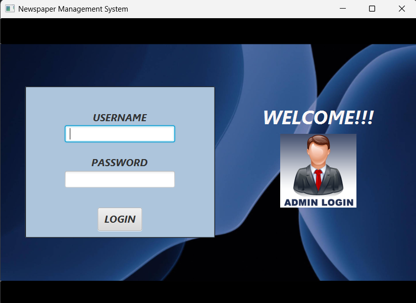
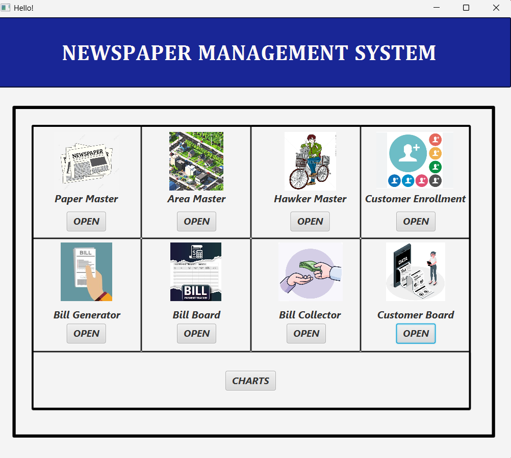
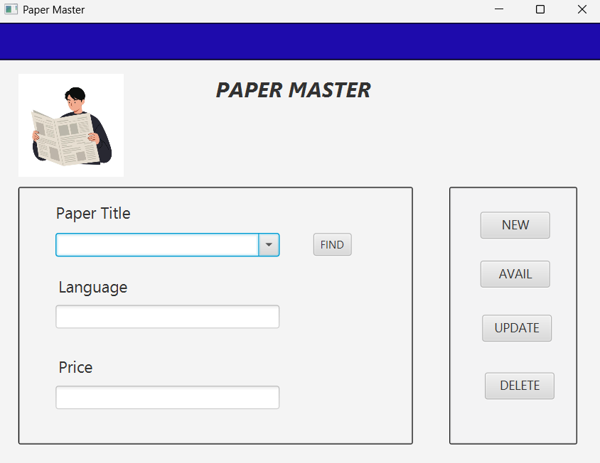
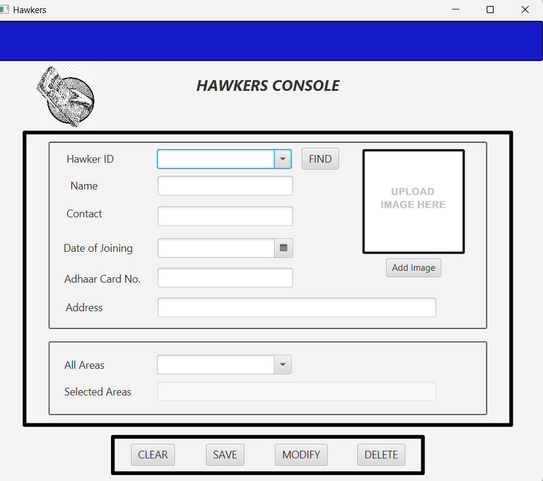
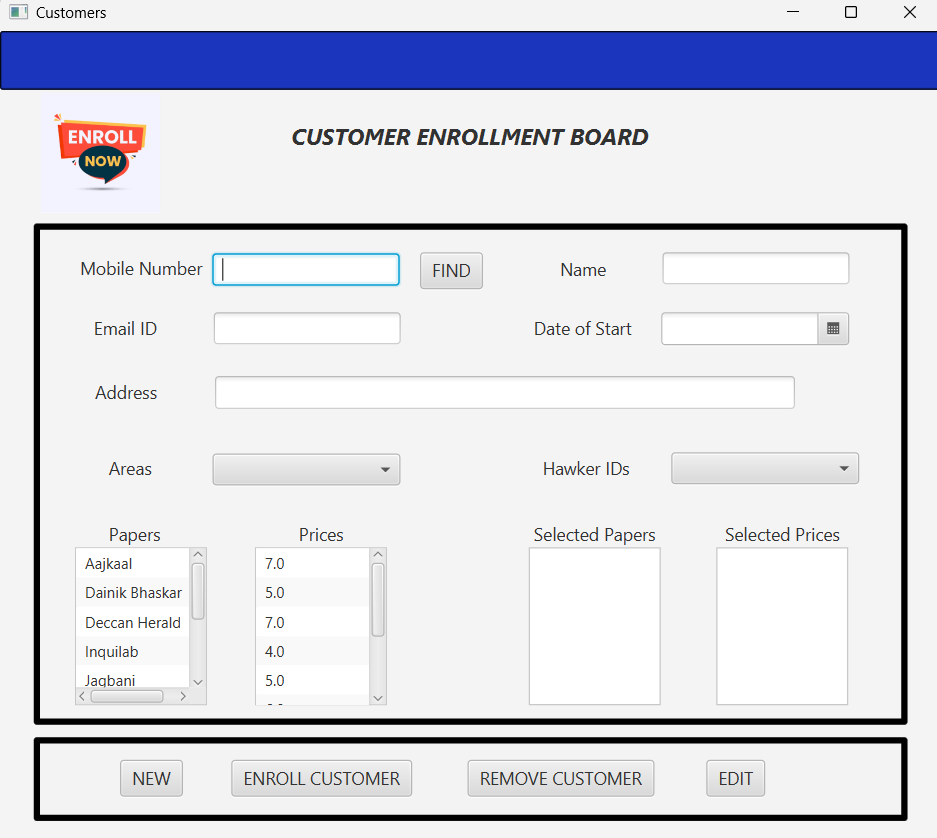
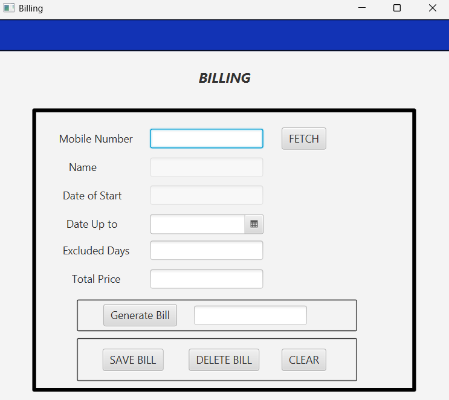
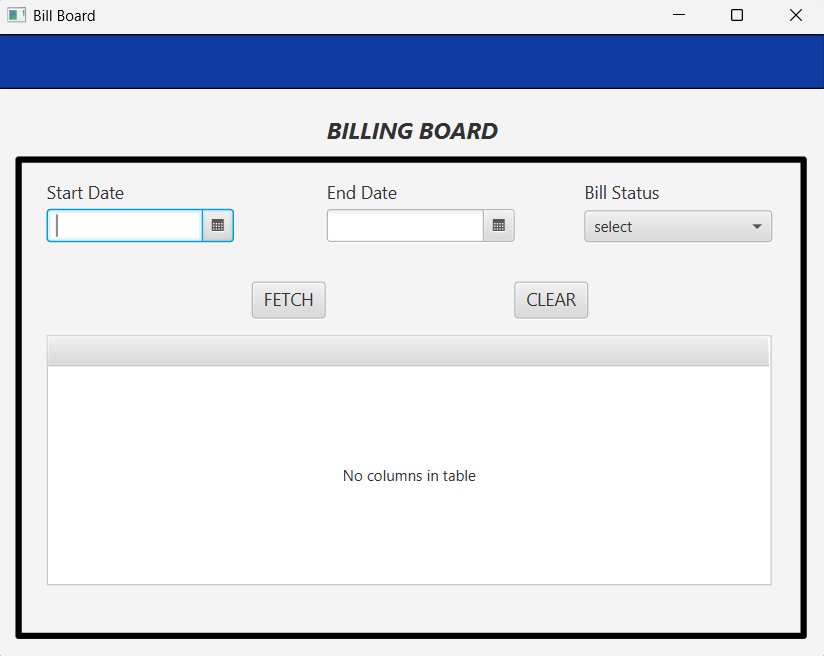
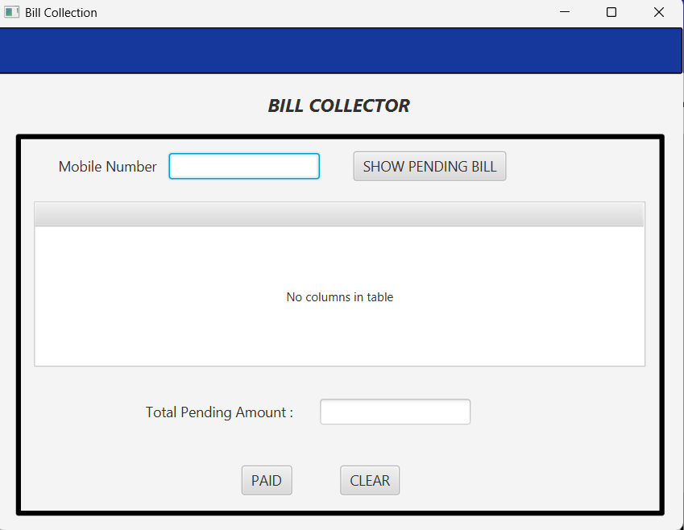
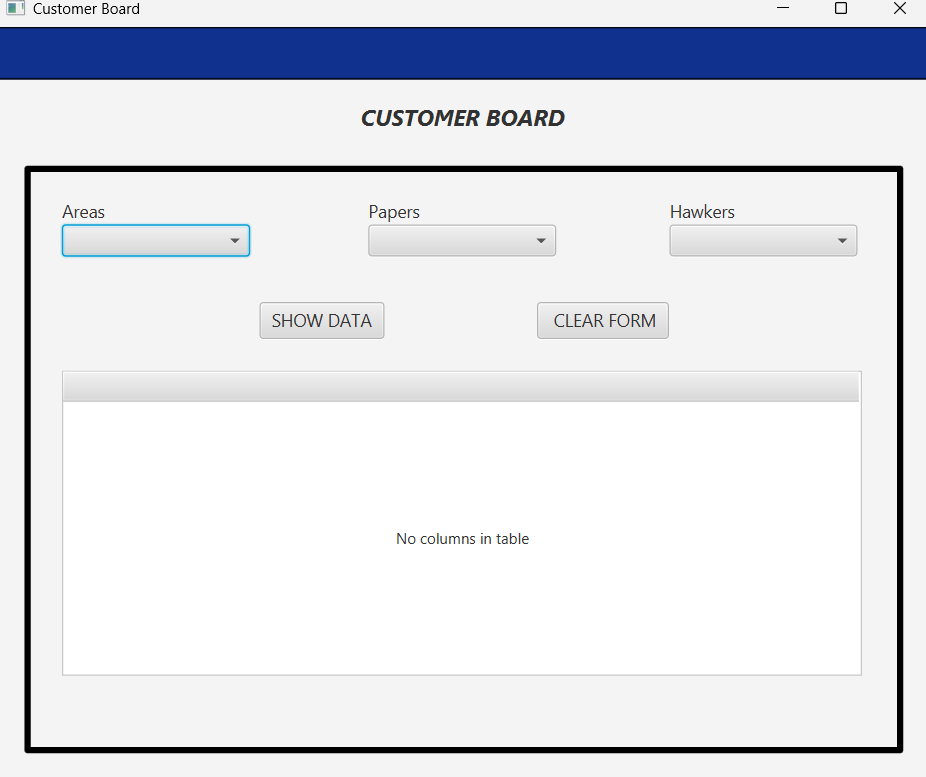
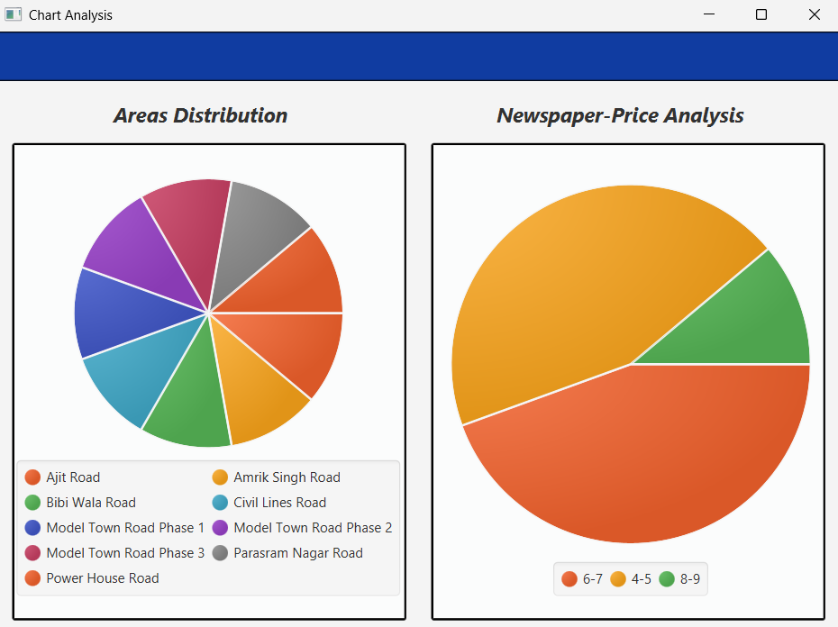

# Newspaper Management System

## Project Overview

The Newspaper Management System is a JavaFX-based desktop application developed to automate and manage newspaper distribution operations. The system provides a centralized platform for managing newspapers, delivery areas, hawkers, customer subscriptions, billing, payment collection, and analytical reports.

The application is designed for newspaper agencies to efficiently handle daily operations while reducing manual work and improving record management.

## Features

### Admin Login

* Secure login system for administrator access.
* Ensures only authorized users can access the application.

### Paper Master

* Add and manage newspaper details.
* Store, avail, delete and update newspaper title, language, and price information.

### Area Master

* Manage newspaper delivery areas.
* Organize customer subscriptions based on delivery locations.

### Hawker Master

* Register and manage hawker information and the areas he will be delivering newspapers.
* Store:

  * Hawker ID
  * Name
  * Contact Number
  * Date of Joining
  * Aadhaar Number
  * Address
  * Image

### Customer Enrollment

* Register and manage customer subscriptions.
* Store:

  * Customer Name
  * Mobile Number
  * Email ID
  * Address
  * Subscription Start Date
  * Delivery Area
  * Selected Newspapers

### Bill Generator

* Generate customer bills automatically.
* Retrieve customer information using mobile number.
* Calculate total subscription charges.

### Bill Board

* View billing records within a specified date range.
* Filter bills based on:

  * All Bills
  * Paid Bills
  * Unpaid Bills

### Bill Collector

* Check pending customer bills.
* Mark bills as paid after payment collection.

### Customer Board

* View customer records using filters such as:

  * Area
  * Newspaper
  * Hawker

### Charts Dashboard

* Visual representation of data using pie charts.
* Area-wise distribution analysis.
* Newspaper-wise distribution based on pricing categories.

## Technologies Used

* Java
* JavaFX
* Scene Builder
* MySQL
* JDBC
* Maven

## System Workflow

1. Administrator logs into the system.
2. Newspaper details are added through Paper Master.
3. Delivery areas are created through Area Master.
4. Hawker information is managed through Hawker Master.
5. Customers are enrolled and assigned newspapers.
6. Bills are generated for subscribed customers.
7. Payment status is tracked using Bill Collector.
8. Billing reports are viewed through Bill Board.
9. Customer records are analyzed using Customer Board.
10. Charts provide graphical insights into newspaper distribution and coverage.

## Project Structure

Admin Login
    |
    v
Dashboard
├── Paper Master
├── Area Master
├── Hawker Master
├── Customer Enrollment
├── Bill Generator
├── Bill Board
├── Bill Collector
├── Customer Board
└── Charts Dashboard

## Database Modules

* Newspaper Management
* Area Management
* Hawker Management
* Customer Management
* Billing Management
* Payment Management
* Reporting and Analytics

## How to Run the Project

1. Clone the repository:
git clone https://github.com/your-username/Newspaper-Management-System.git

2. Open the project in IntelliJ IDEA.

3. Configure the MySQL database.

4. Update database connection settings if required.

5. Build the project using Maven.

6. Run the JavaFX application.

## Screenshots

###Login Page

###Dashboard

###Paper Master

###Hawker Master

###Customer Enrollment

###Bill Generator

###Bill Board

###Bill Collector

###Customer Board

###Charts 

